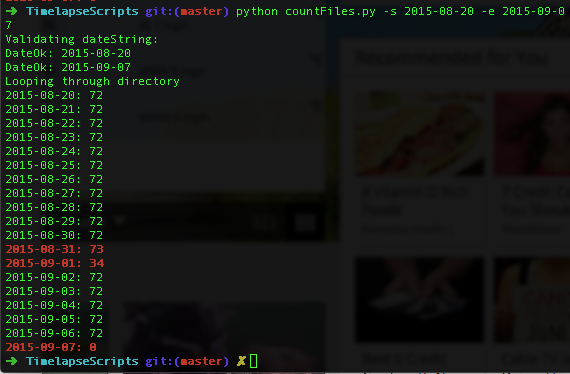

##Timelapse scripts

Simplest&mdash;possibly the jenkiest&mdash;timelapse system ever created

Two cron jobs are in operation: One causes the Raspberry Pi to take pictures periodically, currently every 20 minutes. The other runs once a day, causing the Mac to download the prior day's pictures from the Raspberry Pi.

There are two Python scripts, both run manually. *makeMovie.py* goes through the images, removes the ones that are too dark (since the timelapse also runs through the night), and stitches the rest into a video. *countFiles.py* acts as a check, counting the number of files in a folder per day for a given range of days, making it easier to confirm that all pictures have been downloaded.

###Quick summary

* **simpleCam.sh**: Bash script set to run as cron job on Raspberry Pi
* **autoDownload.sh**: Logs into Raspberry Pi and downloads all pictures taken the prior day.
* **makeMovie.py**: Stitches still images together to mp4.
* **countFiles.py**: Counts the number of files per day. If the number is other than 72 (the number when taking a picture every 20 minutes), the output is bold red.

###Setup

####File structure
Folder structure of both machines.

####Cron job on Raspberry Pi
**simpleCam.sh** lives on the Raspberry Pi. This takes a picture and names it with the date/time format YYYY-MM-DD_HHMM. The Mac cron job and both Python scripts require this naming convention.

The script can go where you like: I have it in ```/home/pi/camera```.

Make it executable:

```chmod +x simpleCam.sh```

Set up the cronjob. Open the cron table for editing:

```sudo crontab -e ```

Add the schedule at the bottom. The schedule below runs the bash script, which takes the picture, every 20 minutes. (See more information [here](https://www.raspberrypi.org/documentation/linux/usage/cron.md)).

```0,20,40 * * * * /home/pi/camera/simpleCam.sh 2>&1```
 
####Cron job on Mac
**autoDownload.sh** lives on the Mac. It logs into the Raspberry Pi once a day and downloads the prior day's images, based on the date/time naming convention.

This also must be exectuable:

```chmod +x autoDownload.sh```

The command for editing differs from the Raspberry Pi:

```EDITOR=nano crontab -e```

Set up the Mac cronjob for once a day:

```9 11 * * * /Users/SandlapperNYC/Development/RaspberryPi/TimelapseScripts/autoDownload.sh```

This runs the job at 11:09 am every day. I also have the Mac scheduled, under **System Preferences > Energy Saver > Schedule...**, to come on or wake up every day at 11:00am and shut down at 11:30am.

This script requires SSH keys between the Mac and the Raspberry Pi, so that the Mac doesn't have to enter a password to access the Raspberry Pi. Instructions are available [here](https://www.raspberrypi.org/documentation/remote-access/ssh/passwordless.md).

####Creating the movie

**makeMovie.py** creates the movie. It does the following steps:

* creates a temporary directory
* goes through the folder with the timelapse images
* skips files without the .jpg extension
* skips .jpg files that are too dark
* for .jpg images with enough light, it creates symbolic links in the temporary directory with sequential numerical names
* runs an ffmpeg command to create the movie and save it
* deletes the symbolic links
* deletes the temporary directory

####Cleaning up
Test the amount of disk space on the Raspberry Pi by sshing in and running ```df -h``` from the command line.

Manually remove files without prompt:

```rm <file> --force```

For example, to remove all photos from September 2015, type

```rm 2015-09-*.jpg --force```

Before removing, check to make sure the files have correctly copied onto the Mac. If you take a picture every 20 minutes, there should be 72 pictures per day.

**countFiles.py** checks all the pictures within a specific data range, and if there aren't 72 pictures, it prints that date in red:



Run the script with the start and end dates using the -s and -e flags:

```python countFiles.py -s 2015-08-20 -e 2015-09-07```


